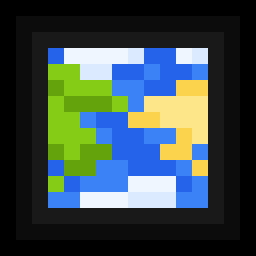

<p align="center"><a href="https://modrinth.com/mod/biolith"></a></p>

# Biolith Examples
This mod provides a testing framework for Biolith in Fabric, Forge, and
NeoForge, with modifications to all three vanilla dimensions.  The testing
configuration may be useful as usage examples, and over time I intend to
add further usage examples to this mod.

## Mod Configuration

* [Fabric](https://github.com/gniftygnome/biolith-examples/blob/master/fabric/build.gradle)
* [Forge](https://github.com/gniftygnome/biolith-examples/blob/master/forge/build.gradle)
* [NeoForge](https://github.com/gniftygnome/biolith-examples/blob/master/neoforge/build.gradle)

## Biome Placement

Testing placements are here: [BiolithExamples.java](https://github.com/gniftygnome/biolith-examples/blob/master/common/src/main/java/com/terraformersmc/biolithexamples/BiolithExamples.java)

Things to check when testing Biolith with this mod:
* In the Overworld, Cherry Grove is removed and roughly replaced by Crimson forest, and the features should generate.
* In the Overworld, all Plains should be replaced with Warped Forest, and the features should generate.
* In the Overworld, a portion generally less than 20% of Deserts should be replaced by Mega Pine Taiga.
* In the Nether, all Warped Forests should be replaced with End Highlands (features do not generate).
* In the End, all End Highlands should be replaced with Plains, and the features should generate (villages too).

## Releases via Maven

Much like Terraform API, add the Terraformers maven repository to your `build.gradle`:

```
repositories {
    maven {
        name = 'TerraformersMC'
        url = 'https://maven.terraformersmc.com/'
    }
}
```

And add the Biolith version for your loader (fabric, forge, or neoforge)
to the dependencies section of `build.gradle`:

```
dependencies {
    modImplementation("com.terraformersmc:biolith-fabric:${project.biolith_version}")
}
```

If you wish to include Biolith in your mod for distribution, wrap the `modImplementation()` with an `include()`

Finally, set the Biolith version you want in `gradle.properties`:

```
biolith_version=1.2.0-beta.3
```

For convenience, [Biolith can also be downloaded from Modrinth](https://modrinth.com/mod/biolith).

## Old examples from the Biolith README

```java
public void during_mod_init() {
    // Place a biome at a specific noise point
    BiomePlacement.addNether(ModBiomeKeys.LUMINOUS_GROVE, MultiNoiseUtil.createNoiseHypercube(0.35F, 0.3F, 0.0F, 0.0F, 0.0F, 0.0F, 0.225F)); }

    // replace a vanilla biome 20% of the time
    BiomePlacement.replaceOverworld(BiomeKeys.FOREST, ModBiomeKeys.AUTUMNAL_WOODS, 0.2D);

    // add an edge sub-biome
    BiomePlacement.addSubOverworld(BiomeKeys.DESERT, ModBiomeKeys.OASIS, SubBiomeMatcher.of(SubBiomeMatcher.NEAR_BORDER));

    // add a sub-biome based on noise
    BiomePlacement.addSubOverworld(ModBiomeKeys.LUSH_DESERT, ModBiomeKeys.OASIS, SubBiomeMatcher.of(SubBiomeMatcher.Criterion.ofMax(SubBiomeMatcher.CriterionTargets.PEAKS_VALLEYS, SubBiomeMatcher.CriterionTypes.DISTANCE, 0.2f)));

    // register surface rule(s)
    SurfaceGeneration.addOverworldSurfaceRules(Identifier.of(Mod.MOD_ID, "surface_rules"), modSurfaceRules);

    // use surface builders
    // See the javadocs for this; surface builders are a complicated topic.
    // See also: [Terrestria's surface builders](https://github.com/TerraformersMC/Terrestria/tree/1.19.3/worldgen/src/main/java/com/terraformersmc/terrestria/surfacebuilders)
}
```